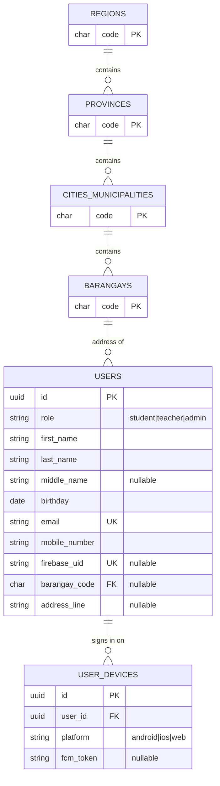
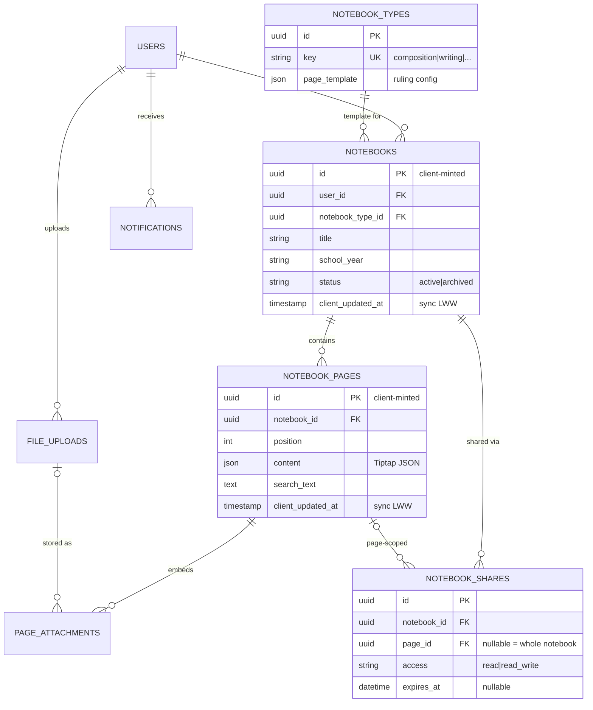
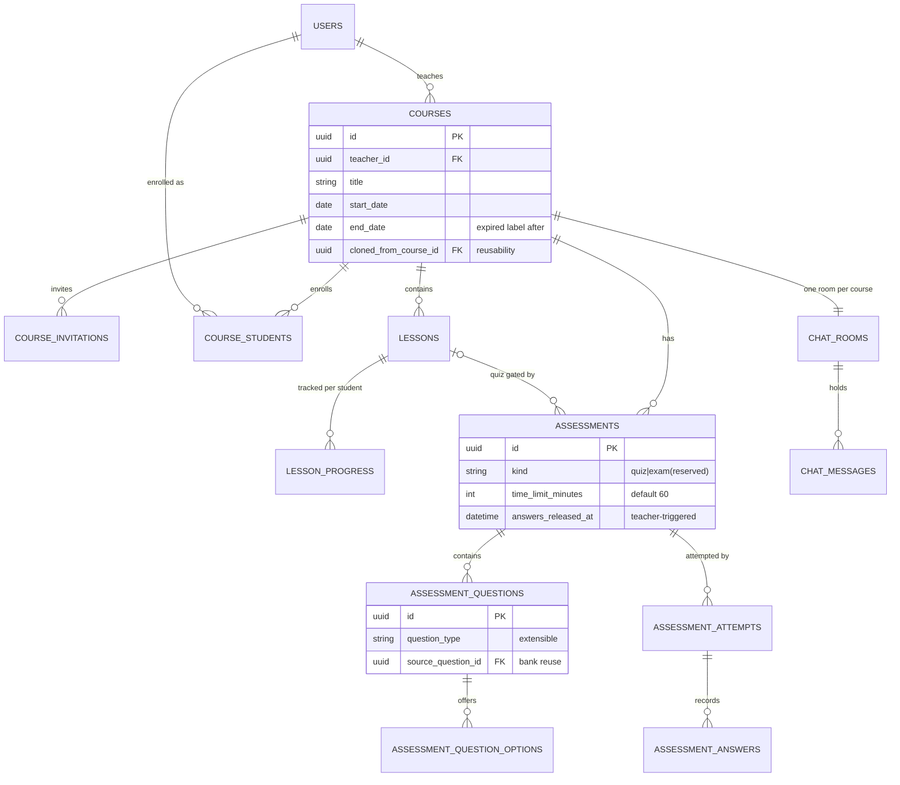
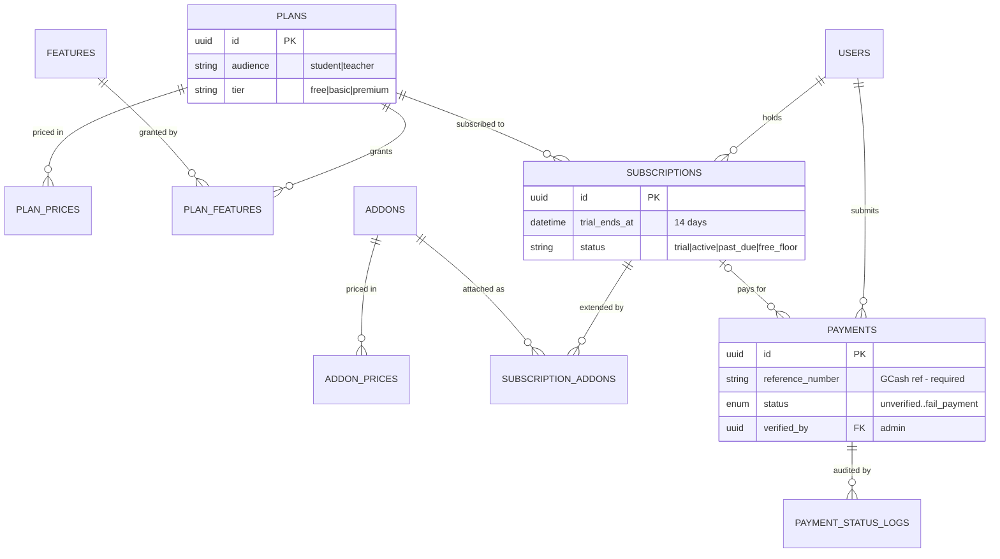

# Notebook — Database Schema Plan (MVP: M1–M3)

_Task 2026-09-13-004, Phase 1. Development reference — the source of truth for migrations and for the "Project Structure with ER Diagram" client document. Every design choice cites its decision ID._

Status: **LOCKED — approved by the Lead Developer 2026-09-13.** Changes from here require a new decision, not a drive-by edit.

---

## 1. Schema-wide conventions

| Convention | Rule | Why |
|---|---|---|
| Primary keys | `id CHAR(36)` UUIDv7 on every domain table (D-013). Client-generated on offline-writable tables; server-generated (`Str::uuid7()` via `HasUuids`) elsewhere. | Offline devices mint IDs the server accepts as-is; time-ordered so B-tree locality is fine |
| PK exception | PSGC tables use the official PSGC 10-digit code as a natural `CHAR(10)` PK | Government reference data with a stable official identifier; server-only, never client-minted |
| Charset/engine | `utf8mb4` / `utf8mb4_unicode_ci`, InnoDB, everywhere from migration one | MIIT's mixed `latin1`/`utf8mb4` lesson (findings §6) |
| Timestamps | `created_at` / `updated_at` on all tables; `TIMESTAMP(3)` precision on synced tables | `updated_at` doubles as the pull cursor (see §2) |
| Soft deletes | `deleted_at` on ALL user-content tables (notebooks, pages, courses, lessons, chat…) — never hard-delete user content | Archiving is the product promise (D-023: data never deleted); tombstones required for sync (§2) |
| Money | Integer minor units (`amount_minor` INT UNSIGNED = centavos/cents) + `currency CHAR(3)` | No float money, ever |
| Enums | MySQL `ENUM` only for closed, brief-specified sets (payment status); otherwise `VARCHAR` + PHP enum class | Brief says notebook types and question types will grow — those are rows/varchars, not schema changes |
| Migrations | Fake-timestamp counter `0001_01_01_NNNNNN_<verb>_<subject>_table.php`, related tables grouped per file (CLAUDE.md §5) | Locked convention |
| Naming | snake_case tables/columns; FK = `<singular>_id`; pivot/unique keys named explicitly | Matches the shared-TS-types contract (D-005) — API emits these exact names |

## 2. Offline-sync contract (D-013, D-016, D-017)

Three sync classes; each table in §4–§7 is tagged with one:

- **[RW]** offline read-write — `notebooks`, `notebook_pages`, `page_attachments`. Live in on-device SQLite; created/edited offline.
- **[RO]** offline read-only cache — courses, lessons, assessment metadata, own attempts/scores, profile, `notebook_types`, PSGC. Pulled to SQLite for offline viewing; never written on device.
- **[ON]** online-only — everything else (quiz taking, chat, payments, sharing, invitations, admin).

Mechanics (implemented once, in one sync module):

1. Extra columns on every **[RW]** table: `client_updated_at TIMESTAMP(3)` (device clock, set by the app on every local edit) alongside server-set `updated_at` and `deleted_at`.
2. **Pull** (RW + RO): `GET /api/sync/<table>?since=<server updated_at cursor>` returns rows with `updated_at > since` **including tombstoned rows** (`deleted_at` set), paginated; client upserts/deletes locally and stores the new cursor per table.
3. **Push** (RW only): client keeps a local outbox of dirty rows; `POST /api/sync/<table>` with row batches. Server applies **last-write-wins on `client_updated_at`** per row (incoming older than stored ⇒ rejected, returned to client as the winning server copy), always stamps fresh `updated_at`, enforces ownership (`user_id = auth user`) on every row.
4. Deletes are soft on both sides: a local delete sets `deleted_at` + `client_updated_at`, pushes as a normal update.
5. Attachments: binary files are NOT synced as rows. `page_attachments.upload_status` tracks `pending → uploaded`; the device uploads the file when online, then patches the row with the server `file_upload_id`.

---

## 3. ER overview — four domains

Domain diagrams below; full column detail in the sections after each. Diagram attributes are trimmed to keys + defining columns for readability — the tables are authoritative.

## 4. Domain: Identity & Address — M1

### `users` — [RO] (own row cached) · M1 · D-014, D-015
| Column | Type | Notes |
|---|---|---|
| id | CHAR(36) PK | UUIDv7, server-generated |
| role | VARCHAR(16) | `student` / `teacher` / `admin` (PHP enum). One person = one row; role upgrades are an UPDATE, not a second account |
| first_name / last_name | VARCHAR(100) | required (brief) |
| middle_name | VARCHAR(100) NULL | optional (brief) |
| birthday | DATE | required (brief) |
| email | VARCHAR(255) UNIQUE | Firebase-verified identity anchor |
| mobile_number | VARCHAR(20) | required (brief) |
| firebase_uid | VARCHAR(128) UNIQUE NULL | set on first Firebase→Sanctum exchange (D-015); NULL only for seeded admins |
| password | VARCHAR(255) NULL | optional per brief — Firebase owns primary auth; nullable local password for admin fallback only |
| barangay_code | CHAR(10) FK→barangays NULL | PSGC address (brief) — region/province/city derivable by joins |
| address_line | VARCHAR(255) NULL | street/house free text |
| avatar_path | VARCHAR(255) NULL | |
| status | VARCHAR(16) | `active` / `disabled` (admin action) |
| timestamps + deleted_at | | soft delete — a deleted user's notebooks stay recoverable |

No `student_profiles`/`teacher_profiles` satellites yet (D-014 says "if needed" — no role-specific column exists at MVP; add satellites the day one appears, don't pre-create).

No geolocation columns — D-020.

### `user_devices` — [ON] · M1
`id` PK · `user_id` FK · `platform` VARCHAR(10) · `device_identifier` VARCHAR(128) (Capacitor Device id) · `device_name` VARCHAR(100) NULL · `fcm_token` VARCHAR(255) NULL (push) · `last_seen_at` · timestamps. UNIQUE(user_id, device_identifier). Pull cursors are stored client-side; this table exists for FCM push targeting and session visibility.

### PSGC address tables — [RO] · M1
Natural-key reference data, seeded from the official PSA PSGC file (plan README O-1), refreshed on PSA quarterly releases by re-running the seeder.

| Table | Columns |
|---|---|
| `regions` | `code` CHAR(10) PK · `name` |
| `provinces` | `code` CHAR(10) PK · `region_code` FK · `name` |
| `cities_municipalities` | `code` CHAR(10) PK · `province_code` FK NULL (NCR cities have none) · `region_code` FK · `name` · `class` VARCHAR(16) (`city`/`municipality`/`sub_municipality`) |
| `barangays` | `code` CHAR(10) PK · `city_muni_code` FK · `name` |

Dropdown chain per the brief: Region → Province → City/Municipality → Barangay.

## 5. Domain: Notebook core — M1

### `notebook_types` — [RO] · M1 · D-010, D-012
| Column | Type | Notes |
|---|---|---|
| id | CHAR(36) PK | |
| key | VARCHAR(32) UNIQUE | `composition`, `writing`, `drawing`, `diary`, `scrapbook`, `logbook`, `timesheet` — **rows, so new types never need a migration** (brief: "we will be adding new notebook type in the future") |
| name / description | VARCHAR / TEXT | display |
| page_template | JSON | the paper-fidelity config (D-010): ruling pattern (`single_ruled` / `penmanship_blue_red` / `blank` / `grid`), line spacing, margin-line color/position, header fields (e.g. Writing's `Date:`), footer fields (e.g. `Teacher's Signature`, `Parent's Signature`), default block preset (e.g. Timesheet → table) |
| min_level / audience_hint | VARCHAR NULL | optional UI hint (Writing → preschool) |
| requires_ink | BOOL default false | reserved: types that only fully unlock when the drawing/ink block ships (D-012) |
| is_active, sort_order, timestamps | | |

### `notebooks` — **[RW]** · M1 · D-011, D-016
| Column | Type | Notes |
|---|---|---|
| id | CHAR(36) PK | **UUIDv7 minted on device** (D-013) |
| user_id | FK→users | owner; enforced on every sync push |
| notebook_type_id | FK→notebook_types | |
| title | VARCHAR(150) | |
| school_year | VARCHAR(9) | `2026-2027` — the brief's per-school-year lifecycle |
| cover_upload_id | FK→file_uploads NULL | cover photo (brief) |
| font_family | VARCHAR(64) NULL | from the curated bundled set (validation trim) |
| status | VARCHAR(16) | `active` / `archived` (brief: keep as archive, create next year's) |
| archived_at | TIMESTAMP NULL | |
| position | INT | library/gallery ordering |
| client_updated_at | TIMESTAMP(3) | sync LWW (§2) |
| timestamps + deleted_at | | tombstone |

Indexes: (user_id, status), (user_id, updated_at) for pulls.

### `notebook_pages` — **[RW]** · M1 · D-012, D-018
| Column | Type | Notes |
|---|---|---|
| id | CHAR(36) PK | client-minted |
| notebook_id | FK→notebooks | |
| position | INT | page order within the notebook |
| title | VARCHAR(150) NULL | |
| content | JSON | **Tiptap/ProseMirror document** (D-018). Never HTML. Sanitized server-side against the allowed node/mark whitelist on every push |
| search_text | MEDIUMTEXT | plain-text extraction of `content`, maintained on write; FULLTEXT index — "search my notebooks" |
| client_updated_at | TIMESTAMP(3) | sync LWW — page = the conflict unit (single author in MVP makes conflicts rare) |
| timestamps + deleted_at | | |

Indexes: (notebook_id, position), (notebook_id, updated_at), FULLTEXT(search_text).

### `page_attachments` — **[RW]** (row) / upload-when-online (file) · M1 · §2.5
`id` PK client-minted · `page_id` FK · `file_upload_id` FK→file_uploads NULL (set after upload) · `kind` VARCHAR(16) (`image`/`pdf`/`document`) · `local_ref` VARCHAR(255) NULL (device-side path while pending) · `upload_status` VARCHAR(16) (`pending`/`uploaded`/`failed`) · `client_updated_at` · timestamps + deleted_at.

### `file_uploads` — [ON] · M1 · validation §5 (never FTP)
`id` PK · `user_id` FK · `disk` VARCHAR(32) (`public` now, `s3` later) · `path` VARCHAR(255) · `original_name` · `mime_type` VARCHAR(100) (allowlist per category, MIIT's one good upload idea) · `size_bytes` INT UNSIGNED · `sha256` CHAR(64) NULL (dedupe later) · timestamps. Per-tier storage quotas enforced against SUM(size_bytes) per user (D-022/D-023 premium lever).

### `notebook_shares` — [ON] · M1 · brief §2-Sharing
| Column | Type | Notes |
|---|---|---|
| id | CHAR(36) PK | |
| notebook_id | FK→notebooks | |
| page_id | FK→notebook_pages NULL | NULL = whole notebook; set = that page only (brief) |
| shared_by | FK→users | owner |
| shared_with_user_id | FK→users NULL | direct share to a known user… |
| share_token | CHAR(64) UNIQUE NULL | …or link share (M1 ships read-only links first, per validation §3) |
| access | VARCHAR(16) | `read` / `read_write` (brief) — read_write lands after M1's read-only links |
| expires_at | DATETIME NULL | brief: optional access expiration |
| revoked_at | TIMESTAMP NULL | |
| timestamps | | |

CHECK: exactly one of (shared_with_user_id, share_token) set. Shared read_write editing is ONLINE-ONLY (D-016) — no multi-author offline merge in MVP.

### `notifications` — [ON] · M1 · improvement #3 (ONE table, not per-role)
`id` PK · `user_id` FK (recipient — multi-recipient = one row each, which IS the brief's "seen log") · `actor_user_id` FK NULL · `type` VARCHAR(48) (`share_received`, `invite_received`, `invite_answered`, `quiz_submitted`, `payment_verified`, …) · `title` VARCHAR(150) · `body` TEXT NULL · `data` JSON NULL (deep-link payload) · `read_at` TIMESTAMP NULL · timestamps. Index (user_id, read_at, created_at).

## 6. Domain: Classroom — M2

### `courses` — [RO] · M2
`id` PK · `teacher_id` FK→users · `title` · `description` TEXT NULL · `cover_upload_id` FK NULL · `school_year` VARCHAR(9) · `start_date` / `end_date` DATE (course timeline — after `end_date` students see it labeled **expired**, per brief) · `cloned_from_course_id` FK→courses NULL (**reusability**: next term = clone with lessons/assessments, fresh enrollment) · `status` VARCHAR(16) (`draft`/`active`/`ended`) · timestamps + deleted_at.

### `course_invitations` — [ON] · M2 · improvement #9 (net-new vs MIIT)
`id` PK · `course_id` FK · `email` VARCHAR(255) (teacher inputs student's email, per brief) · `student_user_id` FK NULL (resolved when the email matches/creates an account) · `token` CHAR(64) UNIQUE · `status` VARCHAR(16) (`pending`/`accepted`/`declined`/`revoked`/`expired`) · `decline_reason` TEXT NULL (**required when declining** — brief) · `responded_at` · `expires_at` · timestamps. Accept ⇒ creates `course_students` row + notifies teacher (both directions notify, per brief).

### `course_students` — [RO] · M2
`id` PK · `course_id` FK · `student_user_id` FK · `invitation_id` FK NULL · `status` VARCHAR(16) (`active`/`removed`/`completed`) · `enrolled_at` · timestamps. UNIQUE(course_id, student_user_id). Drives chat-channel auth (MIIT pattern worth copying, findings §6).

### `lessons` — [RO] · M2 · D-009, D-018
`id` PK · `course_id` FK · `title` · `content` JSON (Tiptap — same schema as notebook pages) · `video_url` VARCHAR(500) NULL + `video_type` VARCHAR(16) NULL (`youtube`/`web_link`; in-app upload is future per brief) · `available_from` / `available_until` DATE NULL (brief: lesson start/end dates; teacher course-calendar view reads these) · `sort_order` INT · `status` (`draft`/`published`) · timestamps + deleted_at. **PDF/print (D-009) is a rendering pipeline, not a schema feature** — `content` JSON → print stylesheet / server PDF.

### `lesson_progress` — [RO] (own rows) · M2
`id` PK · `lesson_id` FK · `student_user_id` FK · `status` VARCHAR(16) (`not_started`/`in_progress`/`completed`) · `completed_at` TIMESTAMP NULL (**student declares completion ⇒ related quiz activates**, per brief) · timestamps. UNIQUE(lesson_id, student_user_id). No `progress_percent`/`time_spent` columns until a feature needs them (no dead schema — improvement #12).

### Assessment tree — ONE tree for quiz + exam (improvement #2) · M2 ships `kind='quiz'`
**`assessments`** — [RO]: `id` PK · `course_id` FK · `lesson_id` FK NULL (quiz gated by lesson completion; exam is course-level, reserved for M4) · `kind` VARCHAR(8) (`quiz` now, `exam` reserved — brief says exams are "almost identical") · `title` · `instructions` TEXT NULL · `time_limit_minutes` SMALLINT default 60 (brief default) · `passing_score` TINYINT NULL · `max_attempts` TINYINT default 1 · `shuffle_questions` / `shuffle_options` BOOL · `answers_released_at` TIMESTAMP NULL (**correct answers hidden until the teacher triggers release** — brief; NULL = hidden) · `status` (`draft`/`published`) · timestamps + deleted_at.

**`assessment_questions`** — [RO]: `id` PK · `assessment_id` FK · `question_type` VARCHAR(24) (`multiple_choice`/`true_false`/`short_answer` now; VARCHAR because the brief says "any type" grows) · `question` JSON (Tiptap-lite rich text) · `points` DECIMAL(6,2) · `sort_order` · `explanation` TEXT NULL · `source_question_id` FK→assessment_questions NULL (**question-bank reuse with immutable copy** — the one MIIT pattern worth keeping verbatim; also how M4 exams get built "from Quiz collections" per brief) · timestamps.

**`assessment_question_options`**: `id` PK · `question_id` FK · `option_text` VARCHAR(500) · `is_correct` BOOL · `sort_order`.

**`assessment_attempts`** — [ON] to take, [RO] to review own · D-016: `id` PK · `assessment_id` FK · `student_user_id` FK · `attempt_number` TINYINT · `started_at` / `submitted_at` · `total_points` / `max_points` DECIMAL(8,2) · `score_percent` DECIMAL(5,2) (**snapshot at grading — never recomputed on read**, improvement #1) · `status` (`in_progress`/`submitted`/`graded`) · timestamps. UNIQUE(assessment_id, student_user_id, attempt_number). Submitting notifies the teacher (brief). **These raw scores ARE the M-scope grade story (D-008)** — Grade Calculator add-ons read them later.

**`assessment_answers`**: `id` PK · `attempt_id` FK · `question_id` FK · `selected_option_id` FK NULL · `answer_text` TEXT NULL · `is_correct` BOOL NULL · `points_earned` DECIMAL(6,2) NULL · `graded_by` FK→users NULL + `graded_at` NULL (auto- and manual-grading coexist — MIIT pattern) · timestamps. UNIQUE(attempt_id, question_id).

### Chat — course rooms only (D-021, D-007)
**`chat_rooms`** — [ON]: `id` PK · `course_id` FK UNIQUE (one room per course; teacher always present) · timestamps.
**`chat_messages`** — [ON]: `id` PK · `room_id` FK · `sender_id` FK→users (**single FK — no `sender_type`/denormalized names, the D-014 payoff**) · `body` TEXT NULL · `attachment_upload_id` FK→file_uploads NULL (text/images/documents per brief) · timestamps + deleted_at. Index (room_id, created_at). Pusher channel auth derives from `course_students` / `courses.teacher_id`.

## 7. Domain: Billing & Admin — M3

All [ON]. This whole domain is read/written by **one canonical entitlements module** (CLAUDE.md money rule) — no other code computes access.

### `plans` + `plan_prices` + `features` + `plan_features` — the dynamic-tier requirement
- **`plans`**: `id` PK · `audience` VARCHAR(8) (`student`/`teacher` — separate tier ladders per brief) · `tier` VARCHAR(8) (`free`/`basic`/`premium`) · `name` · `is_active` · timestamps. UNIQUE(audience, tier).
- **`plan_prices`**: `id` PK · `plan_id` FK · `currency` CHAR(3) (`PHP`/`USD` now, more later per brief) · `amount_minor` INT UNSIGNED (₱69 ⇒ 6900) · `effective_from` DATETIME · timestamps. **Admin edits price = INSERT new row** (brief: editable anytime) — current price = latest `effective_from`; history preserved for payments audit. Launch seeds: student 6900/12900, teacher 8900/16900.
- **`features`**: `id` PK · `key` VARCHAR(48) UNIQUE (`max_active_notebooks`, `storage_mb`, `premium_fonts`, `read_write_sharing`, …) · `name` · `value_type` (`boolean`/`limit`).
- **`plan_features`**: `plan_id` FK · `feature_id` FK · `value` INT NULL (limit value; NULL = boolean grant). PK(plan_id, feature_id). **Brief's "add a specific feature to Free/Basic/Premium anytime" = a row here, zero code.** Free-floor limits (D-023, e.g. 2 active notebooks) are just the Free plan's rows.

### `addons` + `addon_prices` + `subscription_addons` — Student's/Teacher's AI (deferred activation, schema ready)
Same shape as plans: `addons` (`key` = `student_ai`/`teacher_ai`, `audience`), `addon_prices` (₱89 seeds), `subscription_addons` (`subscription_id` FK · `addon_id` FK · `status` · timestamps).

### `subscriptions` — D-022, D-023
`id` PK · `user_id` FK · `plan_id` FK · `status` VARCHAR(16): `trial` (14 days from registration — plan README O-3) → `active` (verified payment) / **`free_floor`** (trial or paid period lapsed ⇒ auto-drop to the Free plan's entitlements — D-023: never a hard lock) / `past_due` (grace while a payment sits `unverified`/`in_progress` — protects payers from manual-verification delays) · `trial_ends_at` · `current_period_start` / `current_period_end` · timestamps. **Teacher-led access (D-022) is entitlement logic, not schema**: a student's course access checks the *course's teacher's* subscription, in the entitlements module.

### `payments` — brief's exact GCash workflow
`id` PK · `user_id` FK · `subscription_id` FK NULL · `amount_minor` INT UNSIGNED + `currency` CHAR(3) · `method` VARCHAR(16) (`gcash_qr` now; `paymongo`/`maya` reserved) · `reference_number` VARCHAR(64) (**required** — brief) · `message` VARCHAR(255) NULL (optional — brief) · `status` ENUM(`unverified`,`in_progress`,`follow_up`,`received`,`fail_payment`) (**exact brief strings**; closed set ⇒ true ENUM) · `verified_by` FK→users NULL (admin) · `verified_at` · timestamps. `received` ⇒ entitlements module activates the subscription + notifies the payer. Admin "New Payments" page = `status IN (unverified, in_progress, follow_up)`; "History" = the rest.

### `payment_status_logs` — the follow-up trail
`id` PK · `payment_id` FK · `from_status` / `to_status` · `changed_by` FK→users · `note` TEXT NULL (the follow-up communication record) · `created_at`. Admin dashboard "pending payments" count reads `payments`, never this log.

---

## 8. Master table index

| # | Table | Domain | Milestone | Sync | Soft delete |
|---|---|---|---|---|---|
| 1 | users | Identity | M1 | RO (own) | ✓ |
| 2 | user_devices | Identity | M1 | ON | — |
| 3–6 | regions, provinces, cities_municipalities, barangays | Address | M1 | RO | — |
| 7 | notebook_types | Notebook | M1 | RO | — |
| 8 | notebooks | Notebook | M1 | **RW** | ✓ |
| 9 | notebook_pages | Notebook | M1 | **RW** | ✓ |
| 10 | page_attachments | Notebook | M1 | **RW** | ✓ |
| 11 | file_uploads | Files | M1 | ON | — |
| 12 | notebook_shares | Notebook | M1 | ON | — |
| 13 | notifications | Platform | M1 | ON | — |
| 14 | courses | Classroom | M2 | RO | ✓ |
| 15 | course_invitations | Classroom | M2 | ON | — |
| 16 | course_students | Classroom | M2 | RO | — |
| 17 | lessons | Classroom | M2 | RO | ✓ |
| 18 | lesson_progress | Classroom | M2 | RO (own) | — |
| 19 | assessments | Assessment | M2 | RO | ✓ |
| 20 | assessment_questions | Assessment | M2 | RO | — |
| 21 | assessment_question_options | Assessment | M2 | RO | — |
| 22 | assessment_attempts | Assessment | M2 | ON/RO own | — |
| 23 | assessment_answers | Assessment | M2 | ON | — |
| 24 | chat_rooms | Chat | M2 | ON | — |
| 25 | chat_messages | Chat | M2 | ON | ✓ |
| 26 | plans | Billing | M3 | ON | — |
| 27 | plan_prices | Billing | M3 | ON | — |
| 28 | features | Billing | M3 | ON | — |
| 29 | plan_features | Billing | M3 | ON | — |
| 30 | addons | Billing | M3 | ON | — |
| 31 | addon_prices | Billing | M3 | ON | — |
| 32 | subscriptions | Billing | M3 | ON | — |
| 33 | subscription_addons | Billing | M3 | ON | — |
| 34 | payments | Billing | M3 | ON | — |
| 35 | payment_status_logs | Billing | M3 | ON | — |

Plus framework tables (Sanctum `personal_access_tokens`, `cache`, `jobs` — already in the 2026-09-12-002 scaffold).

**Deliberately absent** (improvement #12 — no dead schema): exams-as-separate-tree, assignments, attendance, grades/grade_scale, forum, DM/group chat, Drive/Calendar tokens, AI usage metering. Each lands with its feature; the assessment `kind` column and addon tables are the only forward reservations, both one-column cheap.

## 9. What M1 implements (Phase 4 cut)

Tables 1–13 only, plus the PSGC seeder and the `notebook_types` seeder (7 launch types with their `page_template` JSON per D-010). Migration file grouping (fake-timestamp counter): `users`+`user_devices` · PSGC ×4 · `notebook_types` · `notebooks`+`notebook_pages`+`page_attachments` · `file_uploads` · `notebook_shares` · `notifications`.
